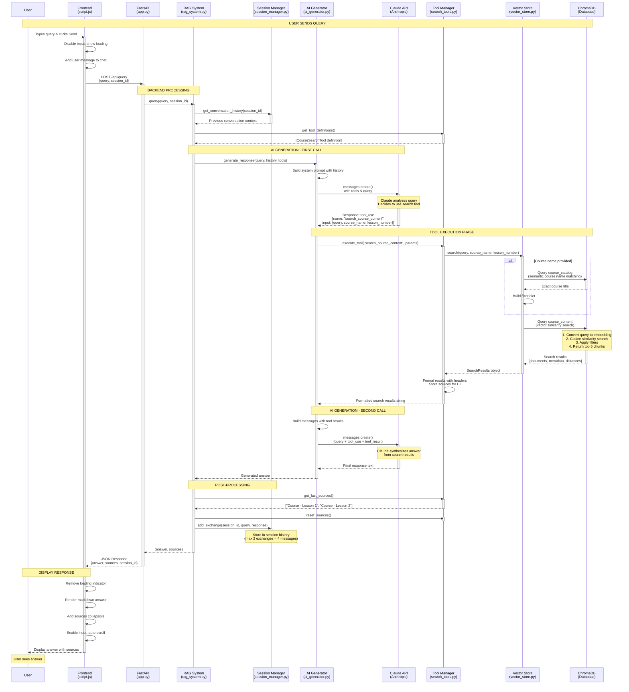

# User Query Flow Diagram

## Interactive Sequence Diagram (Mermaid)



## Complete Flow: Frontend → Backend → AI → Response

```
┌─────────────────────────────────────────────────────────────────────────────┐
│                            FRONTEND (Browser)                                │
│                         frontend/script.js                                   │
└─────────────────────────────────────────────────────────────────────────────┘
                                    │
                                    │ 1. User types query
                                    │    "What is MCP?"
                                    ▼
                    ┌───────────────────────────────┐
                    │  sendMessage() [line 45]      │
                    │  - Validate input             │
                    │  - Show loading spinner       │
                    │  - Disable input fields       │
                    └───────────────┬───────────────┘
                                    │
                                    │ 2. HTTP POST
                                    │    /api/query
                                    │    {
                                    │      "query": "What is MCP?",
                                    │      "session_id": "session_1"
                                    │    }
                                    ▼
┌─────────────────────────────────────────────────────────────────────────────┐
│                         BACKEND - API LAYER                                  │
│                           backend/app.py                                     │
└─────────────────────────────────────────────────────────────────────────────┘
                                    │
                                    │ 3. FastAPI receives request
                                    ▼
                    ┌───────────────────────────────┐
                    │ query_documents() [line 56]   │
                    │ - Create session if needed    │
                    │ - Extract query & session_id  │
                    └───────────────┬───────────────┘
                                    │
                                    │ 4. Call RAG system
                                    ▼
┌─────────────────────────────────────────────────────────────────────────────┐
│                      BACKEND - RAG ORCHESTRATION                             │
│                        backend/rag_system.py                                 │
└─────────────────────────────────────────────────────────────────────────────┘
                                    │
                    ┌───────────────┴───────────────┐
                    │ query() [line 102]            │
                    └───────────────┬───────────────┘
                                    │
                    ┌───────────────┼───────────────┐
                    │               │               │
                    ▼               ▼               ▼
        ┌─────────────────┐  ┌──────────────┐  ┌──────────────┐
        │ Session Manager │  │ Tool Manager │  │ AI Generator │
        │ [line 119]      │  │ [line 126]   │  │ [line 122]   │
        └─────────────────┘  └──────────────┘  └──────────────┘
                    │               │               │
                    │ 5. Get        │ 6. Get tool   │
                    │ conversation  │ definitions   │
                    │ history       │               │
                    │               │               │
                    ▼               ▼               │
        ┌─────────────────────────────────────┐    │
        │ session_manager.py                  │    │
        │ get_conversation_history()          │    │
        │                                     │    │
        │ Returns:                            │    │
        │ "User: Previous question            │    │
        │  Assistant: Previous answer"        │    │
        └─────────────────────────────────────┘    │
                                                    │
                                                    │ 7. Generate response
                                                    ▼
┌─────────────────────────────────────────────────────────────────────────────┐
│                         BACKEND - AI GENERATION                              │
│                        backend/ai_generator.py                               │
└─────────────────────────────────────────────────────────────────────────────┘
                                    │
                    ┌───────────────┴───────────────┐
                    │ generate_response() [line 43] │
                    │ - Build system prompt         │
                    │ - Add conversation history    │
                    │ - Prepare API params          │
                    └───────────────┬───────────────┘
                                    │
                                    │ 8. First Claude API Call
                                    │    (with tools enabled)
                                    ▼
        ┌───────────────────────────────────────────────────┐
        │         Anthropic Claude API (Call #1)            │
        │                                                   │
        │  Model: claude-sonnet-4-20250514                 │
        │  Temperature: 0                                   │
        │  Max Tokens: 800                                  │
        │                                                   │
        │  System: "You are an AI assistant..."            │
        │         + conversation history                    │
        │                                                   │
        │  User: "Answer this question about course        │
        │         materials: What is MCP?"                  │
        │                                                   │
        │  Tools: [search_course_content]                  │
        │  Tool Choice: auto                               │
        └───────────────┬───────────────────────────────────┘
                        │
                        │ 9. Claude decides to use tool
                        │    stop_reason: "tool_use"
                        ▼
        ┌───────────────────────────────────────────────────┐
        │  Claude Response:                                 │
        │  {                                                │
        │    "content": [                                   │
        │      {                                            │
        │        "type": "tool_use",                        │
        │        "name": "search_course_content",           │
        │        "input": {                                 │
        │          "query": "MCP Model Context Protocol",   │
        │          "course_name": "MCP"                     │
        │        }                                          │
        │      }                                            │
        │    ]                                              │
        │  }                                                │
        └───────────────┬───────────────────────────────────┘
                        │
                        │ 10. Handle tool execution
                        ▼
        ┌───────────────────────────────────────────────────┐
        │ _handle_tool_execution() [line 89]               │
        │ - Extract tool calls                             │
        │ - Execute each tool                              │
        │ - Collect results                                │
        └───────────────┬───────────────────────────────────┘
                        │
                        │ 11. Execute search tool
                        ▼
┌─────────────────────────────────────────────────────────────────────────────┐
│                       BACKEND - SEARCH EXECUTION                             │
│                        backend/search_tools.py                               │
└─────────────────────────────────────────────────────────────────────────────┘
                        │
        ┌───────────────┴──────────────────┐
        │ tool_manager.execute_tool()      │
        │ [search_tools.py:135]            │
        └───────────────┬──────────────────┘
                        │
                        ▼
        ┌───────────────────────────────────────────────────┐
        │ CourseSearchTool.execute() [line 52]             │
        │ - Receives: query, course_name, lesson_number    │
        └───────────────┬───────────────────────────────────┘
                        │
                        │ 12. Query vector database
                        ▼
        ┌───────────────────────────────────────────────────┐
        │         vector_store.search()                     │
        │         backend/vector_store.py                   │
        │                                                   │
        │  1. Embed query using sentence transformer       │
        │  2. Search ChromaDB with semantic similarity     │
        │  3. Filter by course_name (if provided)          │
        │  4. Filter by lesson_number (if provided)        │
        │  5. Return top 5 results                         │
        └───────────────┬───────────────────────────────────┘
                        │
                        │ 13. Vector search results
                        ▼
        ┌───────────────────────────────────────────────────┐
        │  Search Results:                                  │
        │  - documents: ["chunk1", "chunk2", "chunk3"]     │
        │  - metadata: [                                    │
        │      {course_title: "MCP", lesson_number: 1},    │
        │      {course_title: "MCP", lesson_number: 2}     │
        │    ]                                              │
        └───────────────┬───────────────────────────────────┘
                        │
                        │ 14. Format results
                        ▼
        ┌───────────────────────────────────────────────────┐
        │ _format_results() [line 88]                      │
        │                                                   │
        │ Output:                                           │
        │ "[MCP - Lesson 1]                                │
        │  MCP stands for Model Context Protocol...        │
        │                                                   │
        │  [MCP - Lesson 2]                                │
        │  MCP allows Claude to connect..."                │
        │                                                   │
        │ Also stores in last_sources:                     │
        │ ["MCP - Lesson 1", "MCP - Lesson 2"]            │
        └───────────────┬───────────────────────────────────┘
                        │
                        │ 15. Return formatted results
                        ▼
        ┌───────────────────────────────────────────────────┐
        │ Back to ai_generator.py                          │
        │ _handle_tool_execution()                         │
        │                                                   │
        │ Build messages array:                            │
        │ [                                                 │
        │   {role: "user", content: original_query},       │
        │   {role: "assistant", content: tool_use_block},  │
        │   {role: "user", content: tool_results}          │
        │ ]                                                 │
        └───────────────┬───────────────────────────────────┘
                        │
                        │ 16. Second Claude API Call
                        │     (without tools)
                        ▼
        ┌───────────────────────────────────────────────────┐
        │         Anthropic Claude API (Call #2)            │
        │                                                   │
        │  Messages:                                        │
        │  1. User: "What is MCP?"                         │
        │  2. Assistant: [tool_use: search_course_content] │
        │  3. User: [tool_result: formatted chunks]        │
        │                                                   │
        │  Tools: NONE (prevents infinite loops)           │
        └───────────────┬───────────────────────────────────┘
                        │
                        │ 17. Claude synthesizes answer
                        ▼
        ┌───────────────────────────────────────────────────┐
        │  Final Claude Response:                           │
        │                                                   │
        │  "MCP (Model Context Protocol) is a framework    │
        │   that allows Claude to connect to external      │
        │   data sources and tools..."                     │
        └───────────────┬───────────────────────────────────┘
                        │
                        │ 18. Return to RAG system
                        ▼
┌─────────────────────────────────────────────────────────────────────────────┐
│                    BACKEND - RAG SYSTEM COMPLETION                           │
│                        backend/rag_system.py                                 │
└─────────────────────────────────────────────────────────────────────────────┘
                        │
        ┌───────────────┴──────────────────┐
        │ Back to query() method           │
        └───────────────┬──────────────────┘
                        │
        ┌───────────────┼──────────────────┐
        │               │                  │
        ▼               ▼                  ▼
  ┌──────────┐   ┌───────────┐   ┌──────────────┐
  │ Get      │   │ Update    │   │ Reset        │
  │ sources  │   │ session   │   │ sources      │
  │ [130]    │   │ [137]     │   │ [133]        │
  └──────────┘   └───────────┘   └──────────────┘
        │               │                  │
        │               ▼                  │
        │   ┌─────────────────────────┐   │
        │   │ session_manager.        │   │
        │   │ add_exchange()          │   │
        │   │                         │   │
        │   │ Stores:                 │   │
        │   │ User: "What is MCP?"    │   │
        │   │ Assistant: "MCP is..."  │   │
        │   │                         │   │
        │   │ (Keeps last 2 exchanges)│   │
        │   └─────────────────────────┘   │
        │                                  │
        └──────────────┬───────────────────┘
                       │
                       │ 19. Return (answer, sources)
                       ▼
        ┌──────────────────────────────────────┐
        │ answer: "MCP is..."                  │
        │ sources: ["MCP - Lesson 1",          │
        │           "MCP - Lesson 2"]          │
        └──────────────┬───────────────────────┘
                       │
                       │ 20. Back to API endpoint
                       ▼
┌─────────────────────────────────────────────────────────────────────────────┐
│                         BACKEND - API RESPONSE                               │
│                           backend/app.py                                     │
└─────────────────────────────────────────────────────────────────────────────┘
                       │
        ┌──────────────┴─────────────────┐
        │ query_documents() [line 68]    │
        │ Build QueryResponse            │
        └──────────────┬─────────────────┘
                       │
                       │ 21. HTTP Response (JSON)
                       │     {
                       │       "answer": "MCP is...",
                       │       "sources": ["MCP - Lesson 1", ...],
                       │       "session_id": "session_1"
                       │     }
                       ▼
┌─────────────────────────────────────────────────────────────────────────────┐
│                         FRONTEND - DISPLAY                                   │
│                         frontend/script.js                                   │
└─────────────────────────────────────────────────────────────────────────────┘
                       │
        ┌──────────────┴─────────────────┐
        │ Receive JSON response [line 76]│
        └──────────────┬─────────────────┘
                       │
        ┌──────────────┼─────────────────┐
        │              │                 │
        ▼              ▼                 ▼
  ┌──────────┐  ┌──────────┐  ┌────────────────┐
  │ Update   │  │ Remove   │  │ Render message │
  │ session  │  │ loading  │  │ with markdown  │
  │ ID [79]  │  │ [84]     │  │ [85, 120]      │
  └──────────┘  └──────────┘  └────────────────┘
                       │
                       │ 22. Display in chat UI
                       ▼
        ┌──────────────────────────────────────┐
        │  Chat Display:                       │
        │                                      │
        │  User: What is MCP?                  │
        │                                      │
        │  Assistant: MCP (Model Context       │
        │  Protocol) is a framework that...    │
        │                                      │
        │  [▼ Sources]                         │
        │    - MCP - Lesson 1                  │
        │    - MCP - Lesson 2                  │
        └──────────────┬───────────────────────┘
                       │
                       ▼
        ┌──────────────────────────────────────┐
        │ Re-enable input fields [92-94]       │
        │ User can send next query             │
        │ (with conversation context)          │
        └──────────────────────────────────────┘
```

## Key Data Structures at Each Stage

### 1. Frontend Request
```json
{
  "query": "What is MCP?",
  "session_id": "session_1"
}
```

### 2. Claude API Call #1 (with tools)
```json
{
  "model": "claude-sonnet-4-20250514",
  "temperature": 0,
  "max_tokens": 800,
  "messages": [{"role": "user", "content": "Answer this question..."}],
  "system": "You are an AI assistant...\n\nPrevious conversation:\nUser: ...",
  "tools": [{
    "name": "search_course_content",
    "description": "Search course materials...",
    "input_schema": {...}
  }],
  "tool_choice": {"type": "auto"}
}
```

### 3. Claude Tool Use Response
```json
{
  "content": [{
    "type": "tool_use",
    "name": "search_course_content",
    "input": {
      "query": "MCP Model Context Protocol",
      "course_name": "MCP"
    }
  }],
  "stop_reason": "tool_use"
}
```

### 4. Vector Search Results
```python
SearchResults(
  documents=["chunk1 text...", "chunk2 text..."],
  metadata=[
    {"course_title": "MCP", "lesson_number": 1},
    {"course_title": "MCP", "lesson_number": 2}
  ]
)
```

### 5. Formatted Tool Results (sent back to Claude)
```
[MCP - Lesson 1]
MCP stands for Model Context Protocol...

[MCP - Lesson 2]
MCP allows Claude to connect to external data sources...
```

### 6. Claude API Call #2 (synthesis)
```json
{
  "messages": [
    {"role": "user", "content": "What is MCP?"},
    {"role": "assistant", "content": [{"type": "tool_use", ...}]},
    {"role": "user", "content": [{"type": "tool_result", ...}]}
  ],
  "system": "...",
  "tools": null  // No tools to prevent loops
}
```

### 7. Final API Response
```json
{
  "answer": "MCP (Model Context Protocol) is...",
  "sources": ["MCP - Lesson 1", "MCP - Lesson 2"],
  "session_id": "session_1"
}
```

## Timeline

| Step | Component | Duration | Notes |
|------|-----------|----------|-------|
| 1-3 | Frontend → Backend | ~50ms | HTTP request |
| 4-7 | RAG Setup | ~10ms | Session/history retrieval |
| 8 | Claude API Call #1 | ~500-1000ms | Tool decision |
| 9-14 | Tool Execution | ~100-200ms | Vector search |
| 15-17 | Claude API Call #2 | ~800-1500ms | Response synthesis |
| 18-20 | Backend Processing | ~10ms | Session update |
| 21-22 | Response → Frontend | ~50ms | HTTP response |
| **Total** | | **~1.5-2.8s** | End-to-end |

## Component Responsibilities

### Frontend (script.js)
- User interaction
- API communication
- Response rendering
- Session tracking

### API Layer (app.py)
- Request validation
- Session creation
- Error handling
- Response formatting

### RAG System (rag_system.py)
- Component orchestration
- Tool management
- History coordination

### AI Generator (ai_generator.py)
- Claude API interaction
- Tool execution loop
- Prompt construction

### Search Tools (search_tools.py)
- Tool definition
- Search execution
- Result formatting
- Source tracking

### Vector Store (vector_store.py)
- Semantic search
- ChromaDB queries
- Course filtering

### Session Manager (session_manager.py)
- History storage
- Context formatting
- Session lifecycle
